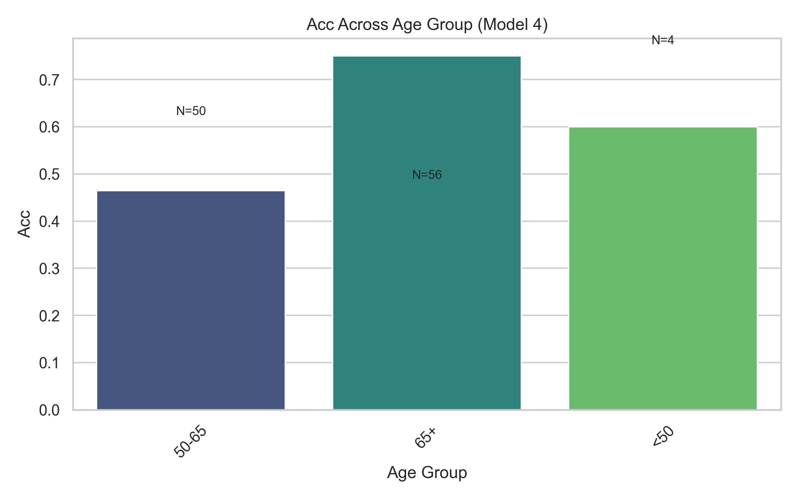
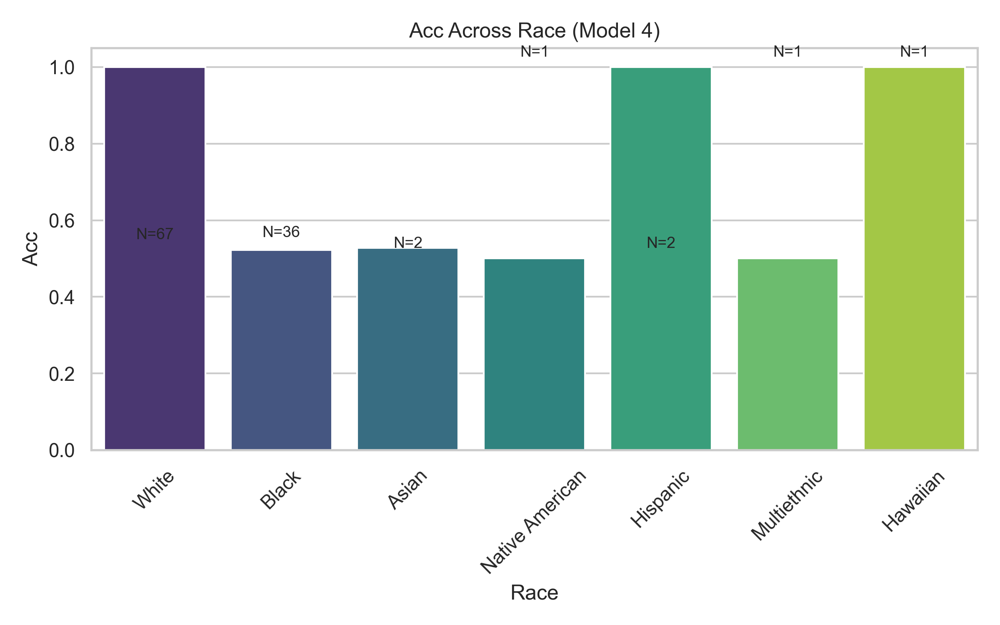

Sure! Here’s the **raw markdown version** of your complete and polished `README.md` — ready to copy and paste directly into your repo:

---

```markdown
# 🩺 Fairness Evaluation in Breast Cancer Classification Using MRI

This project investigates **fairness and bias** in predicting breast cancer treatment response using **MRI imaging features** and **clinical data**. The focus is on understanding whether model performance varies across patient subgroups — such as **age**, **breast density**, or **histological subtype** — and developing strategies to mitigate such disparities.

---

## 📊 Overview

Breast cancer response prediction is an important step in precision oncology. However, if models are biased toward certain demographic or biological groups, their clinical utility becomes limited.  
This project performs:

- Exploratory analysis of imaging and clinical data  
- Data merging and preprocessing for model readiness  
- Machine learning modeling and evaluation  
- Subgroup fairness assessment

---

## 🗃️ Dataset

**Source:** [Duke Breast Cancer MRI dataset – The Cancer Imaging Archive (TCIA)](https://www.cancerimagingarchive.net/)  

**Data Includes:**
- **MRI-derived imaging features** (radiomics, tumor volume, etc.)
- **Clinical features:** age, breast density (T1/T2), tumor response, histology, and treatment outcomes
- **Target variable:** treatment response (binary or categorical)

---


## 🧩 Project Structure

breast-cancer-mri-fairness/
│
├── Data.zip                        # Raw data archive (clinical + imaging)
├── cleaned_clinical.csv            # Cleaned clinical data
├── test_predictions_medfair_ready.csv  # Model predictions output
│
├── eda_clinical.ipynb              # Clinical data exploration and visualization
├── eda_features.ipynb              # Imaging features EDA and correlation analysis
├── Modelling_pipeline.ipynb        # Model training, evaluation, and fairness testing
│
├── load_data.py                    # Data loading and preprocessing utilities
├── merge_data.py                   # Script to merge clinical and imaging datasets
├── main.py                         # End-to-end run script for data prep and modeling
│
├── requirements.txt                # Dependencies list
└── results_lgbm_tuned/             # Model outputs, plots, and fairness results

````

---

## ⚙️ Setup Instructions

### 1. Clone the Repository
```bash
git clone https://github.com/lakshita15/breast-cancer-mri-fairness.git
cd breast-cancer-mri-fairness
````

### 2. Create and Activate a Virtual Environment

```bash
python -m venv venv
source venv/bin/activate  # macOS/Linux
venv\Scripts\activate     # Windows
```

### 3. Install Dependencies

```bash
pip install -r requirements.txt
```

**Key Packages:**

* `numpy`, `pandas`, `matplotlib`, `scikit-learn`
* `torch`, `torchvision` (for modeling and feature representation)
* `pydicom` (for MRI image handling)

---

## 🚀 How to Run the Project

### Step 1: Run EDA

Explore demographics, imaging patterns, and response distributions:

```bash
jupyter notebook eda_clinical.ipynb
jupyter notebook eda_features.ipynb
```

### Step 2: Merge and Preprocess

Merge clinical and imaging data, clean missing values, and standardize features:

```bash
python merge_data.py
```

### Step 3: Run Modeling and Fairness Evaluation

Train classification models and evaluate fairness metrics:

```bash
jupyter notebook Modelling_pipeline.ipynb
```

or use the main pipeline:

```bash
python main.py
```

---

## 📂 Outputs

* **`merged_data.csv`** — Combined clinical + imaging dataset
* **Plots and metrics** in `results_lgbm_tuned/Plots`:

  * Model performance metrics
  * Subgroup comparisons (e.g., by age or breast density)
  * Fairness heatmaps and boxplots
  Model performance comparison:





* **`test_predictions_medfair_ready.csv`** — Final prediction output

---

## 📈 Future Work

* Integrate **deep learning (CNNs)** for MRI feature extraction
* Expand **fairness metrics** (equalized odds, demographic parity)
* Evaluate **model interpretability** across subgroups

---

## ✍️ Author

**Lakshita Mahajan**
*MSc Data Science & Analytics, Toronto Metropolitan University*
**Major Research Project – 2025**
